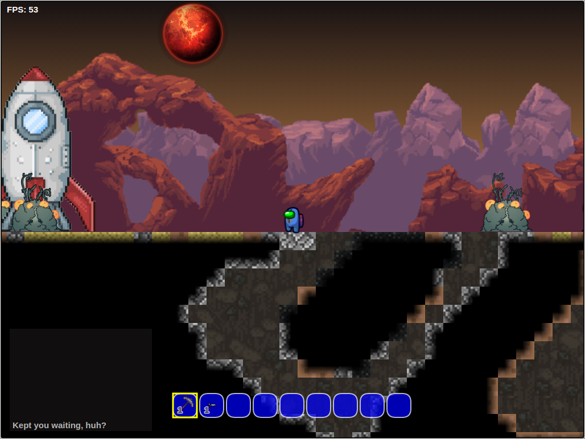

# SpaceCraft ([Play here!](https://otherandrew.github.io/SpaceCraft/))

## Description

SpaceCraft is a 2D sandbox platformer game featuring procedural world generation and an extensive crafting system.

Explore the world, build equipment to fend off enemies, and gather enough materials to repair your ship and escape!

Term project for TCSS 491 - Computational Worlds at the University of Washington Tacoma.

## Getting Started

### Controls

| Input                  | Action                  |
|------------------------|-------------------------|
| `A, D`                 | Walk left / right       |
| `W, SPACE`             | Jump                    |
| `S`                    | Crouch / fast fall      |
| `CLICK`                | Use selected item       |
| `CLICK (empty hand)`   | Interact with furniture |
| `CLICK (with weapon)`  | Shoot weapon            |
| `CLICK (with pickaxe)` | Mine blocks             |
| `TAB`                  | Toggle inventory        |
| `ESC`                  | Exit menu               |
| `1-9, SCROLL`          | Select hotbar item      |

### Dependencies

- Laptop or desktop computer.
- Web browser that supports ECMAScript 2016 (most modern browsers).
- An internet connection.
- Keyboard and mouse recommended.

## Help

### Poor performance

- SpaceCraft runs better on Chromium-based browsers versus Firefox.

### Unable to click on crafting stations or chests

- An empty hotbar slot is required to interact with crafting stations and chests.

## Authors

- [Andrew Nguyen](https://github.com/OtherAndrew)
- [Anthony Nguyen](https://github.com/anguyenq)
- [Jeep Naarkom](https://github.com/codracula)
- [Mario Flores Vences](https://github.com/mfvcreative)

## Version History

### Final deliverable release (3/12/23)

- Added:
  - Procedural monster spawning.
  - Hidden block obfuscation.
  - Vastly expanded crafting system.
  - More monsters (including a final boss!).
  - More weapons.
  - More pickaxes.
  - Monster drops.
  - Sound effects.
  - New player sprite.
- Fixed:
  - Air-jumping when walking off ledges
  - Movement getting stuck when clicking outside game window.

### Minimal deliverable release (2/17/23)

- Added:
  - Vastly expanded terrain generation.
  - Monsters.
  - Weapons.
  - Crafting system.
  - Inventory system.
  - Win and lose conditions.
- Fixed:
  - Collision issues.
- Removed:
  - Jetpack functionality.

###  Prototype release (1/29/23)

- Added:
  - Procedural terrain generation.
  - Block breaking and placing.

## License

This project is licensed under the MIT License - see [LICENSE.txt](LICENSE.txt) for details.

## Acknowledgments

### Sprites:

- [Among Us](https://www.spriters-resource.com/pc_computer/amongus/)
- [Duck Game](https://www.spriters-resource.com/pc_computer/duckgame/)
- [Hollow Knight](https://www.spriters-resource.com/pc_computer/hollowknight/)
- [Minecraft](https://www.spriters-resource.com/pc_computer/minecraft/)
- [Terraria](https://www.spriters-resource.com/pc_computer/terraria/)

### Sounds:

- [Minecraft](https://www.sounds-resource.com/pc_computer/minecraft/)
- [Team Fortress 2](https://www.sounds-resource.com/pc_computer/tf2/)

### Code:

- [README-Template](https://gist.github.com/DomPizzie/7a5ff55ffa9081f2de27c315f5018afc)
- [Super Marriott Brothers](https://github.com/algorithm0r/SuperMarioBros/blob/master/assetmanager.js)
- [Untitled Knight Game](https://github.com/Kenpai718/Untitled-Knight-Game/blob/main/engine/gameengine.js)
